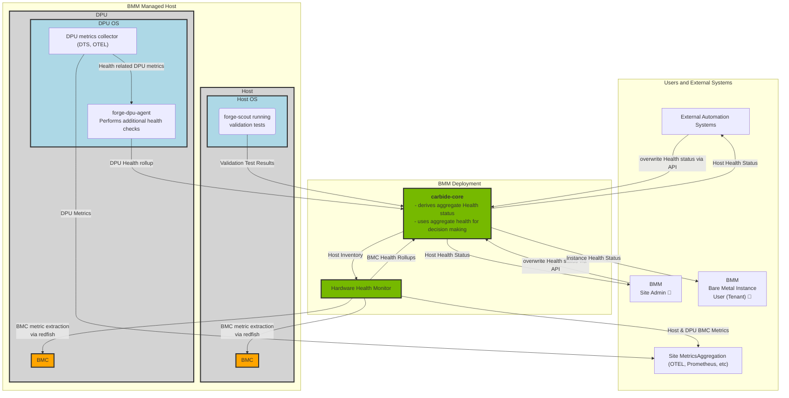

# Bare Metal Manager Health Checks and Health Aggregation

[summary]: #summary

BMM integrates a variety of tools to continuously assess and report the health of any host under its management. It also allows site operators to configure and extend the set of health checks via runtime configurations and extension APIs.

The health information that is obtained by these tools is rolled up within Carbide-Core into an "aggregated host health".
The aggregated host health information is used for multiple purposes:
1. For BMM internal decision making - e.g. "is this host usable as a bare metal instance by a tenant" and "is the host allowed to transition between 2 states".
2. The aggregated host health information is made available to BMM API users. Site administrators can use the information to assess host health and external fleet health automation systems can use it to trigger remediation workflows.
3. A filtered subset of the aggregated health status is made available to tenants in order to inform them whether their host is subject to known problems and whether they should release it.

## Health check types

Health checks roughly fall into 3 categories:
1. Out of band health checks: These continuous health checks are able to continuously assess the health of a host - independent of whether there the host is used as a bare metal instance or not. Within this category, BMM provides the following types of health checks
    1. [BMC health metric based health monitoring](#bmc-health-monitoring)
    2. [BMC inventory based health monitoring](#bmc-inventory-monitoring)
    3. [dpu-agent based health monitoring](#dpu-agent-based-health-monitoring)
2. In band health checks: These health checks run at certain well-defined points in time during the host lifecycle. Within this category, BMM provides the following types of health checks
    1. [Host validation tests](#host-validation-tests)
    2. [SKU validation tests](#sku-validation-tests)
3. Health status assessments by external tools and operators: BMM allows external tooling to provide health information via APIs. These APIs have the same capabilities as all health related tools that are provided by BMM. They can thereby used to extend the scope of health-monitoring as required by site operators. These APIs are described in the [Health overrides](#health-report-overrides)

The overall health of the system can be seen as the combination of all health reports
reports. If any component reports that a subsystem is not healthy, then the
overall system is not healthy. This combination of health-reports is performed
inside `carbide-core` at any time the health status of a host is queried.

A more detailed list of health probes can be found in [Health Probe IDs](health/health_probe_ids.md).  
A list of health alert classifications can be found in [Health Alert Classifications](health/health_alert_classifications.md).

## Overview diagram

The following diagram provides an overview about the current sources of health information within BMM, and how they are rolled up for API users:



## Health Report format

BMM components exchange and store aggregated health information internally in a datastructure called `HealthReport`. It contains a set of failed health checks (`alerts`) as well as a set of succeeded health checks (`successes`). Each check describes exactly which component had been probed (`id` and `target` fields).

The datastructure had been designed and optimized for merging health information from a variety of sources into an aggregate report. E.g. if 2 subsystems report health, and each subsystem reports 1 health alert, the aggregate health report will contain 2 alerts if the alerts are reported by different probe IDs.

A Health report is described as follows in gRPC format. Health reports are in some workflows also exposed in other formats - e.g. JSON. These formats would still follow the same schema.

```proto3
// Reports the aggregate health of a system or subsystem
message HealthReport {
  // Identifies the source of the health report
  // This could e.g. be `forge-dpu-agent`, `forge-host-validation`,
  // or an override (e.g. `overrides.sre-team`)
  string source = 1;
  // The time when this health status was observed.
  //
  // Clients submitting a health report can leave this field empty in order
  // to store the current time as timestamp.
  //
  // In case the HealthReport is derived by combining the reports of various
  // subsystems, the timestamp will relate to the oldest overall report.
  optional google.protobuf.Timestamp observed_at = 2;
  // List of all successful health probes
  repeated HealthProbeSuccess successes = 3;
  // List of all alerts that have been raised by health probes
  repeated HealthProbeAlert alerts = 4;
}

// An alert that has been raised by a health-probe
message HealthProbeAlert {
  // Stable ID of the health probe that raised an alert
  string id = 1;
  // The component that the probe is targeting.
  // This could be e.g.
  // - a physical component (e.g. a Fan probe might check various chassis fans)
  // - a logical component (a check which probes whether disk space is available
  //   can list the volume name as target)
  //
  // The field is optional. It can be absent if the probe ID already fully
  // describes what is tested.
  //
  // Targets are useful if the same type of probe checks the health of multiple components.
  // If a health report lists multiple probes of the same type and with different targets,
  // then those probe/target combinations are treated individually.
  // E.g. the `in_alert_since` and `classifications` fields for each probe/target
  // combination are calculated individually when reports are merged.
  optional string target = 6;
  // The first time the probe raised an alert
  // If this field is empty while the HealthReport is sent to carbide-api
  // the behavior is as follows:
  // - If an alert of the same `id` was reported before, the timestamp of the
  // previous alert will be retained.
  // - If this is a new alert, the timestamp will be set to "now".
  optional google.protobuf.Timestamp in_alert_since = 2;
  // A message that describes the alert
  string message = 3;
  // An optional message that will be relayed to tenants
  optional string tenant_message = 4;
  // Classifications for this alert
  // A string is used here to maintain flexibility
  repeated string classifications = 5;
}

// A successful health probe (reported no alerts)
message HealthProbeSuccess {
  // Stable ID of the health probe that succeeded
  string id = 1;
  // The component that the probe is targeting.
  // This could be e.g.
  // - a physical component (e.g. a Fan probe might check various chassis fans)
  // - a logical component (a check which probes whether disk space is available
  //   can list the volume name as target)
  //
  // The field is optional. It can be absent if the probe ID already fully
  // describes what is tested.
  //
  // Targets are useful if the same type of probe checks the health of multiple components.
  // If a health report lists multiple probes of the same type and with different targets,
  // then those probe/target combinations are treated individually.
  // E.g. the `in_alert_since` and `classifications` fields for each probe/target
  // combination are calculated individually when reports are merged.
  optional string target = 2;
}
```

### Classification of health probe results

For failed health checks, the `HealthProbeAlert` can carry an optional set of `classifications` that describe how the system will react on the failed health check.

The core idea here is that not all types of alerts have the same significance, and that different alerts will require a different response by BMM and site administrators: E.g. a BGP peering failure with a BGP peering issue on just one of the 2 redundant links will not render a host automatically unusable, while a fully unreachable DPU implies that the host can't be used.

Health alert classifications decouple the BMM logic from the actual alert IDs. E.g. BMM logic does not have to encode an exhaustive check over all possible health probe IDs:
```rust
if alert.id == "BgpPeeringFailure" || alert.id === BmcUnreachable || lots_of_other_conditions {
    host_is_fit_for_instance_creation = false;
}
```

Instead of this, it can just scan whether any of the health alerts in the aggregate host health carries a certain condition:
```rust
if alert.classifications.contains("PreventAllocations") {
  host_is_fit_for_instance_creation = false;
}
```

This mechanism also allows site-administrator provided health checks via [Health report override APIs](#health-report-overrides) to trigger the same behavior as integrated health checks.

The set of classifications that are currently interpreted by BMM is described in [List of Health Alert Classifications](health/health_alert_classifications.md)

## In band health checks

### Host validation tests

BMM will schedule the execution of validation tests at via the `scout` tool on the actual host host at various points
in the lifecycle of a managed host:
1. When the host is ingested into BMM
2. After an instance is released by tenant and got cleaned up
3. On demand while the host is not assigned to any tenant

The set of tests that are run on a host are defined by the site administrator.
Each test is defined as an arbitrary shell script which needs to run and is expected to return an exit code of `0`.
The framework thereby allows the execution of off-the-shelf tests, e.g. using the tools [dcgm](https://docs.nvidia.com/datacenter/dcgm/latest/user-guide/index.html), `stress-ng` or `benchpress`.

If Host validation fails, a Health Alert with ID `FailedValidationTest` or `FailedValidationTestCompletion` will be placed on the host to make the host un-allocatable by tenants.

In addition to that, the full test output (stdout and stderr) will be stored within carbide-core and is made available to BMM users via APIs, admin-cli and admin-ui.

Details can be found in the [Machine validation manual](../manuals/machine_validation.md).

### SKU validation tests

SKU validation is a feature in BMM which validates that a host contains all the hardware it is expected to contain by validating it to "conform to a certain SKU".
The SKU is the definition of hardware components within the host. And the SKU validation workflow compares it the the set of hardware components that have been detected via BMM hardware discovery workflows - which utilize inband data as well as out of band data.

SKU validation can thereby e.g. detect
- whether a host has the right type of CPU installed
- whether a host has the right amount of memory installed
- whether a host has the right type and amount of GPUS installed
- whether a host has the right type and amount of InfiniBand NICs installed, and whether they are connected to switches

SKU validation runs at the same points in the host lifecycle as machine validation tests, and can also be run on-demand while the host is not assigned to any tenant.

If SKU validation fails, a Health Alert with ID `SkuValidation` will be placed on the host
to make the host un-allocatable by tenants.

Details can be found in the [SKU validation manual](../manuals/sku_validation.md).

## Out of band health monitoring

### BMC health monitoring

The [`carbide-hw-health`](../../../crates/health) service periodically queries all Host and DPU BMCs in the system for health information. It emits the captured health datapoints as metrics on a metrics endpoint that can be scraped by a standard telemetry system (prometheus/otel).

Health metrics fetched from BMCs include:
- Fan speeds
- Temperatures
- Power supply utilization, outputs and voltages

In addition to metrics, `carbide-hw-health` also extracts the values of various event-logs from the BMC and stores them on-disk in order to make them easily accessible for a standard telemetry exporter (e.g. OpenTelemetry Collector based).

Finally, `carbide-hw-health` also emits a health-rollup in `HealthReport` format towards `carbide-core` that contains an assessed health status of the host based on the extracted metrics.
This assessed health status is built by comparing the metrics that are emitted from BMCs against well-defined
ranges or by interpreting the `health_ok` values provided by BMCs.

### BMC inventory monitoring

The Site Explorer process within Carbide Core periodically queries all Host and DPU BMCs in order to record certain BMC properties (e.g. components within a host and firmware versions).

In certain conditions the scraping process will place a health alert on the host:
- If the host BMC is not reachable
- If any of the host properties indicates the host is not fit for instance creation.

### dpu-agent based health monitoring

[`dpu-agent`](../../../crates/agent) collects health information directly on the DPU and sends a health-**rollup** towards `carbide-core`. The agent monitors a variety of health conditions, including
- whether BGP sessions are established to peers according to the current configuration of the DPU
- whether all required services on the DPU are running
- whether the DPU is configured in restricted mode
- whether the disk utilization ib below a threshold

## Health report overrides

Site administrators are able to update the health state of any BMM managed host via
the API calls `InsertHealthReportOverride` and `RemoveHealthReportOverride`.

The override API offers 2 different modes of operation:
1. `merge` (default) - In this mode, any health probe alerts indicated in the override
  will get merged with health probe alerts reported by builtin BMM tools in order
  to derive the aggregate host health status. **This mode is meant to augment the internal health monitoring mechanism with additional sources of health data**
1. `replace` - In this mode, the health probe alerts reported by builtin BMM
  monitoring tools will be ignored. Only alerts that are passed as part of the
  override will be taking into account. If the override list is empty, the system
  will behave as if the Host would be fully healthy. **This mode is meant to bypass the internal health data in case the site operator desires a different behavior**

The API allows to apply multiple `merge` overrides to a hosts health at the same time by using a different `HealthReport::source` identifier.
This allows to integrate health information from multiple external systems and users which are not at risk of overriding each others data. E.g. health information from an external fleet health monitoring system and from SREs can be stored independently.

If a ManagedHosts health is overriden, the remaining behavior is exactly the same
as if the overridden Health report would have been directly derived from monitoring
hardware health:
- The host will be allocatable depending on whether any `PreventAllocations` classification is present in the aggregate host health
- State transitions behave as if BMM integrated monitoring would have detected
  the same health status:
  - A ManagedHost whose health status is overridden from healthy to not-healthy
    will stop performing certain state transitions that require the host to be healthy.
  - A ManagedHost whose health status is overridden from not-healthy to healthy
    will perform state transitions that it would eitherwise not have performed.
    This is useful for unblocking hosts in certain operational scenarios - e.g.
    where the integrated health monitoring system reported a host as non-healthy
    for an invalid reason.
- BMM API users will observe that the ManagedHost is not healthy. They
  will also observe that a health override is applied.
