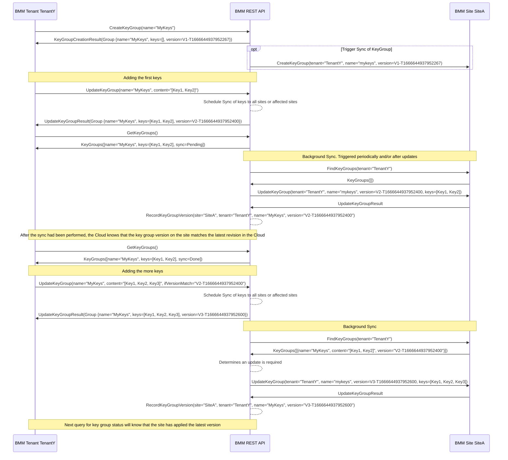

## Key Group Synchronization

Key groups are lists of SSH Keys and groups of them in order to provide access to the SSH console for users.

The key group update and synchronization mechanism in BMM REST API works as follows:

1. Key groups are stored per tenant. They can be uniquely identified by the tenant org identifier and a unique key group name that the tenant chooses. Therefore no additional UUID based ID is required.
2. The source of truth for the content of key groups is stored in the BMM REST API.
3. Key groups are versioned. Whenever a key group is modified by a user (key added or removed), a version field for the group is changed to a unique new value. Usage of the same version format that BMM entities already use (e.g. `V1-T1666644937952267` makes sense, but is not strictly necessary).
4. The BMM REST API backend synchronizes the contents of the key groups to all BMM sites that the tenant selected (or potentially even just all sites that the tenant is enabled for).
5. The BMM REST API stores for each Site/Tenant/KeyGroupName combination, which version is already stored on a site. By having this information available, the BMM REST API can efficiently look up whether key groups have been synced to required destinations by comparing the most recent key group version (owned by the cloud) with the synchronized key group version.
6. After a BMM Tenant changed the contents of a key group in the BMM REST API, the Cloud needs to update all target sites with the latest state. There are multiple approaches for this:
    1. The BMM Tenant explicitly triggers the sync via UI. Triggering the sync will let the Cloud Backend compare the latest deployed state of a keygroup on one site with the version in the Cloud database, and update it if required. This approach is not required because it requires the BMM tenant to monitor the deployment status on all sites.
    2. The BMM REST API periodically syncs the state of all Key Groups to all sites. It can iterate over all the gropus it has knowledge about and all sites, and update the group contents for sites where there is a mismatch. This requires some extra work for groups where no content changes occurred, but is otherwise fairly straightforward to implement and free from race conditions.
    3. BMM REST API only schedules updates for key groups if the BMM Tenant updated the state of a group. This is a bit more efficient, but harder to cover all edge-cases. E.g. the Cloud needs to account for
        - sites being temporarily offline during the sync
        - sites being restored from backups and having outdated keygroup versions or missing keygroups
        - users triggering multiple keygroup updates in rapid succession
7. BMM provides the ability to fully overwrite the content of a keygroup that is identified by a `(TenantOrg, GroupName)` tuple and indexed by a `Version`. It will echo the version of a keygroup as is back to the Cloud, and not change it by itself or interpret it in any way.
8. The BMM REST API **could** expose the version number of key groups to users - however it does not have to. By exposing the version number, it can provide update APIs with `ifVersionNotMatch` semantics - which means adding the capability for UIs to fail changes to groups if a concurrent edit occurred. This avoids Forge Tenant Admins from accidentally overwriting changes that another Tenant Admin for the same org performed.

