# Managed Host State Diagrams

This document contains the complete Finite State Machine (FSM) that illustrates the lifecycle of BMM managed hosts from discovery through ingestion through instance assignment and management.

## High-Level Overview

The main flow shows the primary states and transitions between them:

<!-- Keep the empty line after this or here or the diagram will break -->

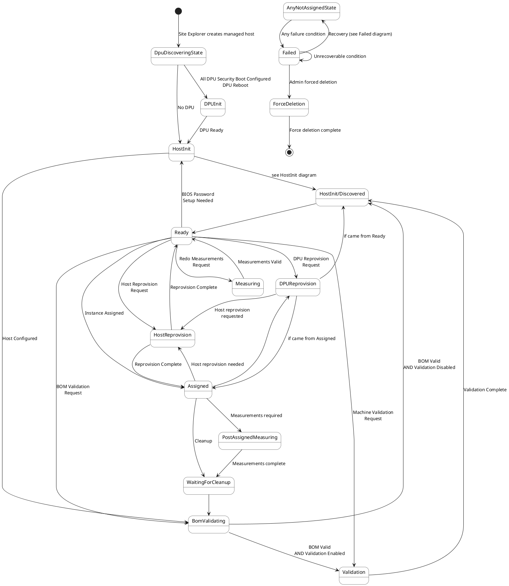

## DPU Discovery State Details (DpuDiscoveringState)

Shows the complete DPU discovery and configuration process:

<!-- Keep the empty line after this or here or the diagram will break -->

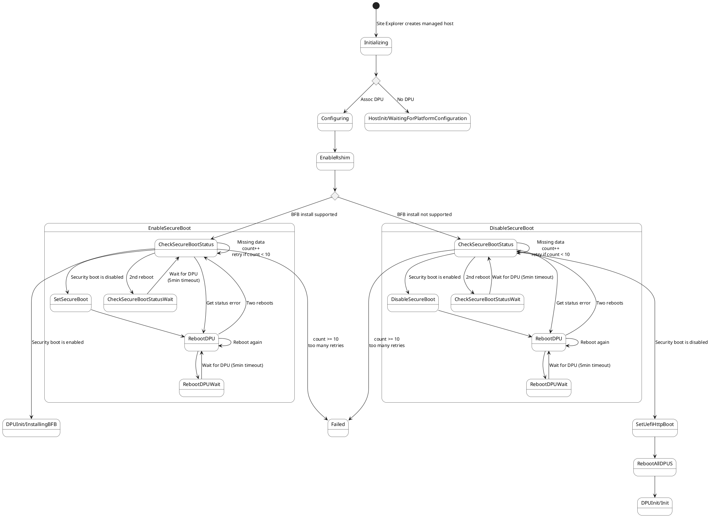

## DPU Initialization State Details (DpuInitState)

Shows DPU initialization including BFB installation:

<!-- Keep the empty line after this or here or the diagram will break -->

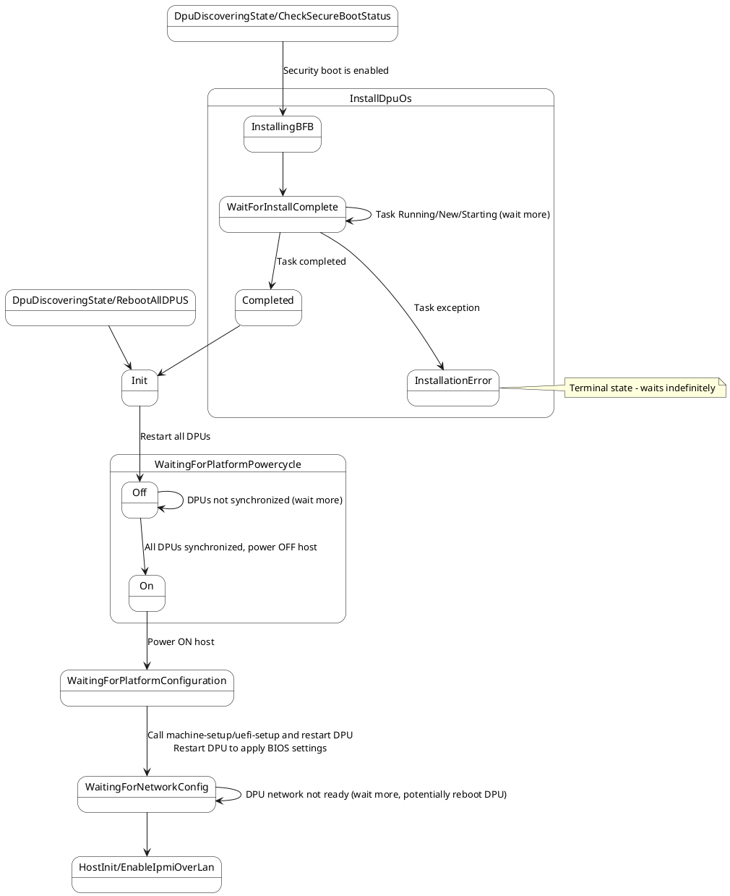

## Host Initialization State Details (HostInitState)

Shows host initialization including boot order and UEFI setup:

<!-- Keep the empty line after this or here or the diagram will break -->

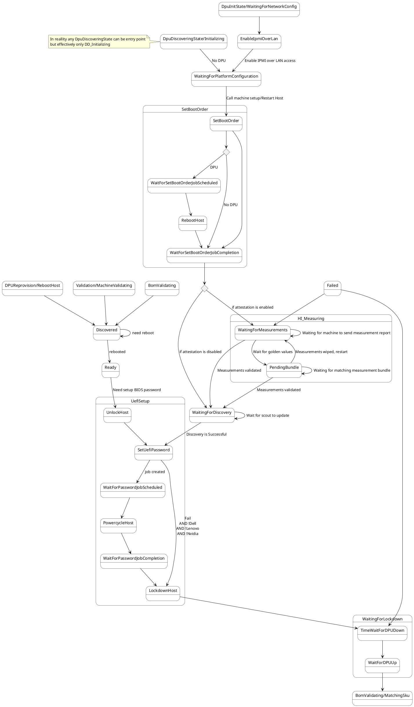

## BOM Validation State Details (BomValidating)

Shows the BOM (Bill of Materials) validation process:

<!-- Keep the empty line after this or here or the diagram will break -->

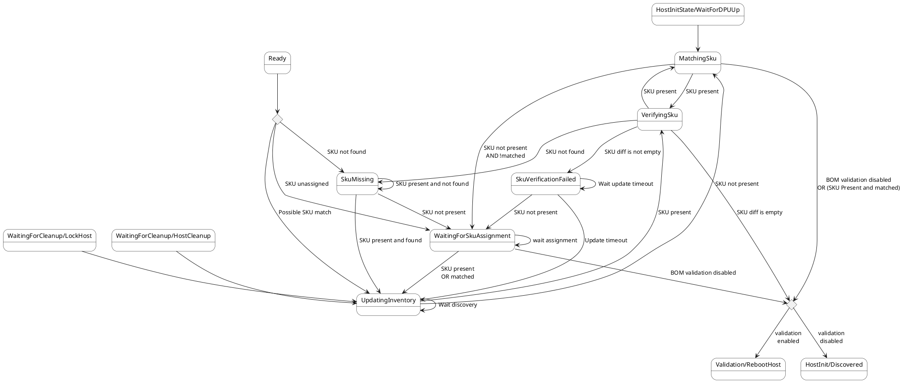

## Machine Validation State Details (ValidationState)

Shows the machine validation process:

<!-- Keep the empty line after this or here or the diagram will break -->

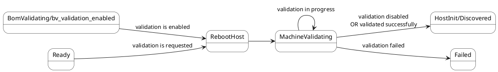

## Ready State Details (Ready)

Shows what can happen in Ready state:

<!-- Keep the empty line after this or here or the diagram will break -->

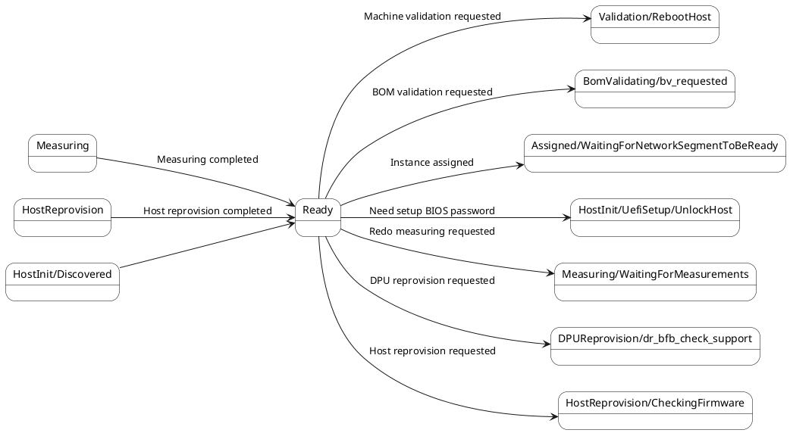

## Instance Assignment State Details (InstanceState)

Shows the complete instance assignment and management flow:

<!-- Keep the empty line after this or here or the diagram will break -->

```plantuml
@startuml
skinparam state {
  BackgroundColor White
  BorderColor Black
}

' ========================================
' States
'

'' Incoming states
state Ready
state "DPUReprovision/DR_RebootHost" as DPUReprovision_DR_RebootHost
state "HostReprovision/HR_CheckingFirmware" as HostReprovision_HR_CheckingFirmware

'' Own states
state "WaitingForNetworkSegmentToBeReady" as A_WaitingForNetworkSegmentToBeReady
state "WaitingForNetworkConfig" as A_WaitingForNetworkConfig
state "WaitingForStorageConfig:" as A_WaitingForStorageConfig
state "WaitingForRebootToReady:" as A_WaitingForRebootToReady
state "Assigned/Ready:" as A_Ready
state "WaitingForDpusToUp:" as A_WaitingForDpusToUp
state "BootingWithDiscoveryImage:" as A_BootingWithDiscoveryImage
state "SwitchToAdminNetwork:" as A_SwitchToAdminNetwork
state "WaitingForNetworkReconfig:" as A_WaitingForNetworkReconfig
state a_release_instance <<choice>>
state "Assigned/Failed" as A_Failed
state "NetworkConfigUpdate" as A_NetworkConfigUpdate {
  state "WaitingForNetworkSegmentToBeReady" as A_NCU_WaitingForNetworkSegmentToBeReady
  state "WaitingForConfigSynced" as A_NCU_WaitingForConfigSynced
  state "ReleaseOldResources" as A_NCU_ReleaseOldResources
}
state "HostPlatformConfiguration" as A_HostPlatformConfiguration {
    state "PowerCycle" as A_HPC_PowerCycle
    state "CheckHostConfig" as A_HPC_CheckHostConfig
    state "UnlockHost" as A_HPC_UnlockHost
    state "ConfigureBios" as A_HPC_ConfigureBios
    state "PollingBiosSetup" as A_HPC_PollingBiosSetup
    state "SetBootOrder" as A_HPC_SetBootOrder {
        state "SetBootOrder" as A_HPC_SBO_SetBootOrder
        state "WaitForSetBootOrderJobScheduled" as A_HPC_SBO_WaitForSetBootOrderJobScheduled
        state "RebootHost" as A_HPC_SBO_RebootHost
        state "WaitForSetBootOrderJobCompletion" as A_HPC_SBO_WaitForSetBootOrderJobCompletion
    }
    state "LockHost" as A_HPC_LockHost
}

'' Outgoing states
state "PostAssignedMeasuring/WaitingForMeasurements" as PostAssignedMeasuring_M_WaitingForMeasurements
state "WaitingForCleanup/Init" as WaitingForCleanup_C_Init
state "DPUReprovision/dr_bfb_check_support" as DPUReprovision_dr_bfb_check_support

' ========================================
' Transitions
'
Ready --> A_WaitingForNetworkSegmentToBeReady : Instance assigned

A_WaitingForNetworkSegmentToBeReady --> A_WaitingForNetworkSegmentToBeReady : segments not ready
A_WaitingForNetworkSegmentToBeReady --> A_WaitingForNetworkConfig : No segment OR segments ready

A_WaitingForNetworkConfig --> A_WaitingForNetworkConfig : Host network not synced on DPU
A_WaitingForNetworkConfig --> A_WaitingForStorageConfig : No DPU\nOR Host network synced on DPU

A_WaitingForStorageConfig --> A_WaitingForRebootToReady : Attach storage volumes
A_WaitingForRebootToReady --> A_Ready : Reboot machine

A_Ready --> A_NCU_WaitingForNetworkSegmentToBeReady : Update network request
A_Ready --> A_HPC_PowerCycle : (Instance deleted OR Host/DPU reporvisioning requested)\nAND need config bootorder
A_Ready --> A_WaitingForDpusToUp : (Instance deleted OR Host/DPU reporvisioning requested)\nAND not need config bootorder\nAND Power is Off
A_Ready --> A_BootingWithDiscoveryImage : (Instance deleted OR Host/DPU reporvisioning requested)\nAND not need config bootorder\nAND Power is On

A_WaitingForDpusToUp --> A_BootingWithDiscoveryImage : DPUs UP-triggered
A_WaitingForDpusToUp --> A_WaitingForDpusToUp : Not DPUs UP-triggered

A_BootingWithDiscoveryImage --> A_BootingWithDiscoveryImage : Retry reboot if needed
A_BootingWithDiscoveryImage --> A_SwitchToAdminNetwork : If instance deleted
A_BootingWithDiscoveryImage --> DPUReprovision_dr_bfb_check_support : DPU reprovision needed
A_BootingWithDiscoveryImage --> HostReprovision_HR_CheckingFirmware : Host reprovision needed
A_BootingWithDiscoveryImage --> A_BootingWithDiscoveryImage : Nothing is needed. Stuck.

DPUReprovision_DR_RebootHost --> A_Ready : Reprovision completed
state "HostReprovision/hr_completed" as HostReprovision_hr_completed
HostReprovision_hr_completed --> A_Ready : Reprovision not needed

A_SwitchToAdminNetwork --> A_WaitingForNetworkReconfig : Update network config

A_WaitingForNetworkReconfig --> A_WaitingForNetworkReconfig : Network not synced
A_WaitingForNetworkReconfig --> a_release_instance : Delete instance & clean network config
a_release_instance --> PostAssignedMeasuring_M_WaitingForMeasurements : attenstation enabled
a_release_instance --> WaitingForCleanup_C_Init : attenstation disabled

A_NCU_WaitingForNetworkSegmentToBeReady --> A_NCU_WaitingForConfigSynced : No segments\nOR All ready
A_NCU_WaitingForNetworkSegmentToBeReady --> A_NCU_WaitingForNetworkSegmentToBeReady : Not all segments ready

A_NCU_WaitingForConfigSynced --> A_NCU_ReleaseOldResources : No DPU\nOR DPU synced
A_NCU_WaitingForConfigSynced --> A_NCU_WaitingForConfigSynced : Wait for DPU synced
A_NCU_ReleaseOldResources --> A_Ready

A_HPC_PowerCycle --> A_HPC_PowerCycle : Wait Power Off
A_HPC_PowerCycle --> A_HPC_CheckHostConfig : Power On
A_HPC_CheckHostConfig --> A_HPC_CheckHostConfig : Wait DPU Up
A_HPC_CheckHostConfig --> A_HPC_UnlockHost : Need config host boot order
A_HPC_CheckHostConfig --> A_WaitingForDpusToUp : No need config host boot order
A_HPC_UnlockHost --> A_HPC_ConfigureBios : BMC lockdown disabled
A_HPC_ConfigureBios --> A_HPC_PollingBiosSetup : Config BIOS
A_HPC_PollingBiosSetup --> A_HPC_PollingBiosSetup : Wait for BIOS setup
A_HPC_PollingBiosSetup --> A_HPC_SBO_SetBootOrder : BIOS is setup
A_HPC_SBO_SetBootOrder --> A_HPC_SBO_WaitForSetBootOrderJobScheduled : Set boot order job scheduled
A_HPC_SBO_WaitForSetBootOrderJobScheduled --> A_HPC_SBO_RebootHost : Job scheduled
A_HPC_SBO_RebootHost --> A_HPC_SBO_WaitForSetBootOrderJobCompletion : Reboot
A_HPC_SBO_WaitForSetBootOrderJobCompletion --> A_HPC_LockHost : Job completed
A_HPC_LockHost --> A_WaitingForDpusToUp : BMC lockdown enabled

state AnyState
AnyState --> A_Failed : Any failure condition
A_Failed --> A_Failed : Wait (stuck, manual action needed)
@enduml
```

## Host Reprovision State Details (HostReprovisionState)

Shows the host firmware reprovision process:

<!-- Keep the empty line after this or here or the diagram will break -->

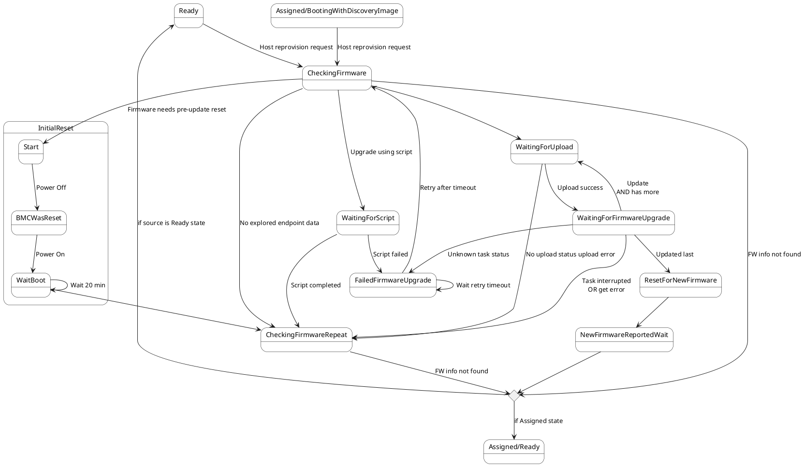

## DPU Reprovision State Details (DpuReprovisionState)

Shows the DPU firmware reprovision process:

<!-- Keep the empty line after this or here or the diagram will break -->

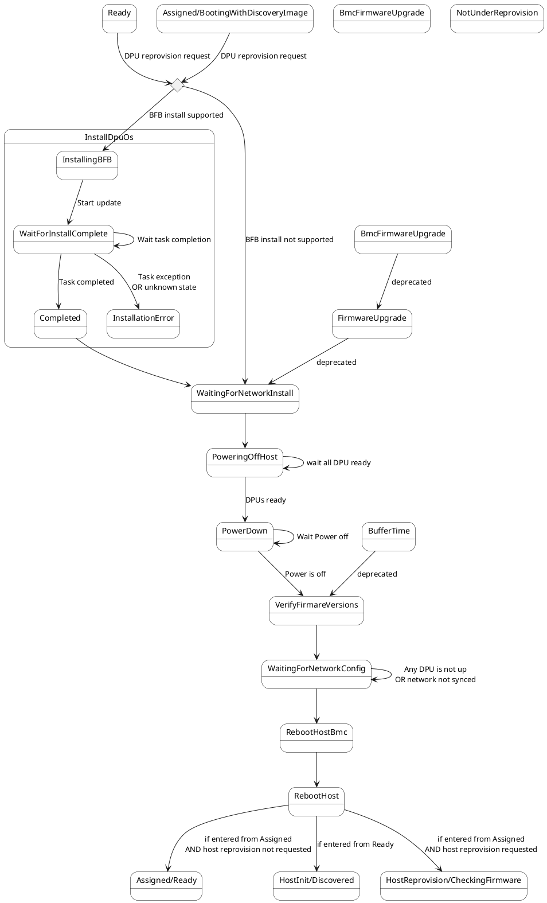

## WaitingForCleanup State Details

<!-- Keep the empty line after this or here or the diagram will break -->

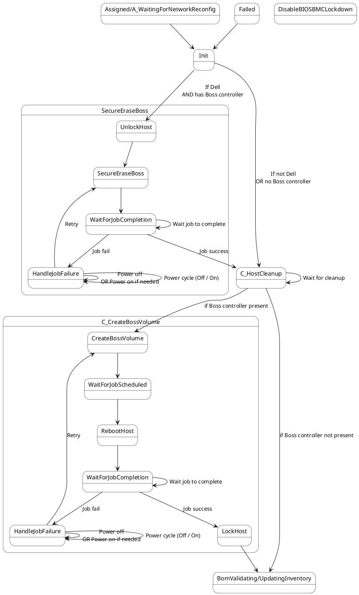

## Measuring and PostAssignedMeasuring State Details

Shows the attestation measurement process.

<!-- Keep the empty line after this or here or the diagram will break -->

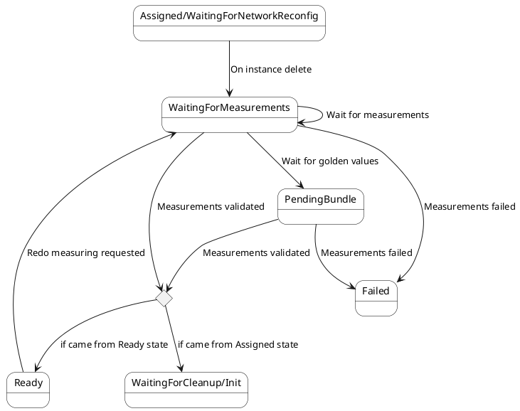

## Failed State

<!-- Keep the empty line after this or here or the diagram will break -->

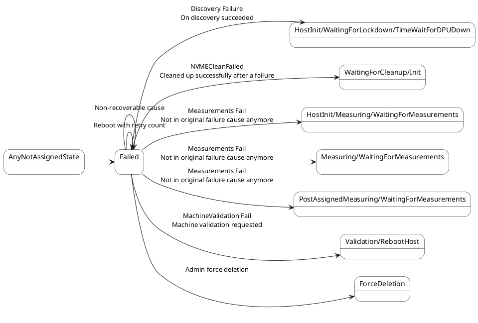

